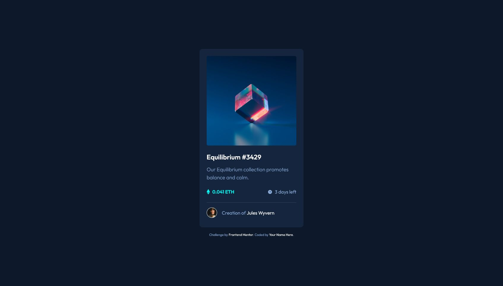
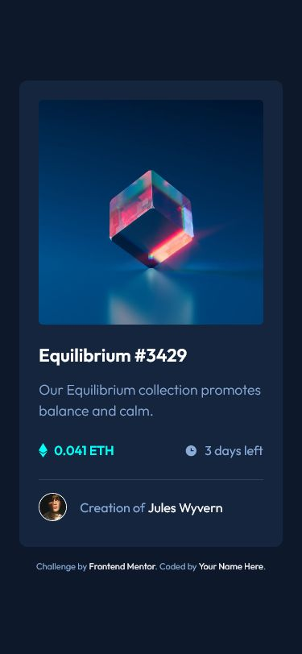

# Frontend Mentor - QR code component solution

This is a solution to the [NFT preview card component challenge on Frontend Mentor](https://www.frontendmentor.io/challenges/nft-preview-card-component-SbdUL_w0U/hub/nft-preview-card-component-hq4tUjH_f). Frontend Mentor challenges help you improve your coding skills by building realistic projects.

## Table of contents

- [Overview](#overview)
  - [Screenshot](#screenshot)
  - [Links](#links)
- [My process](#my-process)
  - [Built with](#built-with)
  - [What I learned](#what-i-learned)
- [Author](#author)

## Overview

Hi! This is my attempt at the NFT preview card challenge.

For this challenge, I once again combined HTML5, pure CSS and used Flexbox for the positioning. For the overlay over the NFT image, I used an overlay `div`.

### Screenshot

Desktop

Mobile

### Links

- Solution URL: [Here!](https://github.com/sheronimo/frontendmentor-nftcard)
- Live Site URL: [Here!](https://sheronimo.github.io/frontendmentor-nftcard/)

## My process

1. I changed the markup to both be more semantic and fit according to my usual styling methods (mainly using class selectors on anything that I'll style).
2. After working on the markup for each "section" of the card, I then styled it.
3. Finishing touches (mostly readjusting spacing and sizing) after each part of the component had been styled according to the design.

### Built with

- Semantic HTML5 markup
- CSS variables
- Flexbox

### What I learned

I learned about how to position overlays on hover. There are various ways to do it (using pseudo-elements, using Flexbox for the items inside the overlay), which I'll consider experimenting with in future developments of the project.

## Author

- Github - [sheronimo](https://github.com/sheronimo)
- Frontend Mentor - [@sheronimo](https://www.frontendmentor.io/profile/sheronimo)
